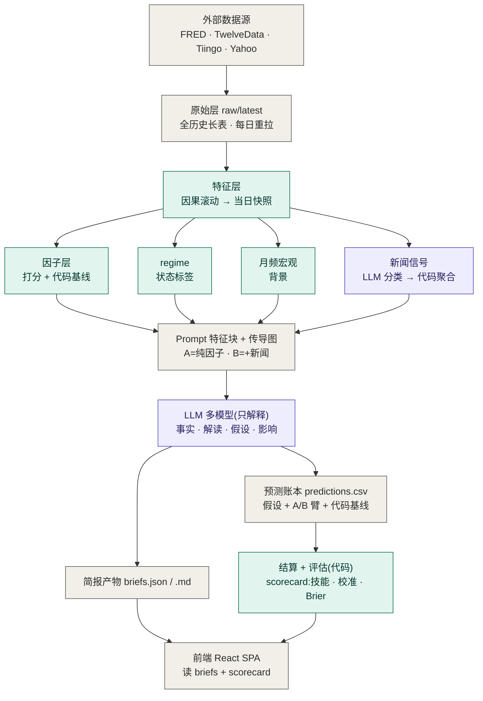

# 数据链路架构(end-to-end data lineage)

> 从原始数据到最终预测/简报的完整链路。高层愿景见 [DESIGN.md](../DESIGN.md);
> 数据文件说明见 [data/README.md](../data/README.md);分版进度见 [docs/refactor/](refactor/readme.md)。

## 贯穿全局的脊柱:代码算数字 → LLM 只解释

下图 **🟢 青色 = 代码算**、**🟣 紫色 = LLM**、**⬜ 灰色 = 数据/产物**。
注意紫色只有两处(新闻分类 + 简报生成)—— **所有数字(特征/因子/基线/结算/评分)都由代码计算,
LLM 只做解释与写预测**。这是整个架构最重要的纪律。

## 逐段拆解(附对应文件/函数)

### ① 原始层 — `fetch_and_store`([pipeline.py](../py/newsletter/pipeline.py))
4 个数据源(带兜底链)拉全历史 → `raw/latest/series.parquet`,一张 `series_id × date → value`
的长表。这是地基,**每天重拉覆盖**(point-in-time 归档见 [data/README.md](../data/README.md) 的 `raw/history`)。

### ② 特征层 — `features.compute_features` → `snapshot_at`([features.py](../py/newsletter/features.py))
在长表上算技术特征(**因果滚动,不偷看未来**:ret_20 / MA200 / z_252 / 相关性 …),
再 `snapshot_at(target_date)` 切出**当日那一行** `snap`(多窗口已压缩进当日读数)。

### ③ 四路并行(全是代码,除新闻分类)
- **因子层** `factors.compute_factors(snap)`([factors.py](../py/newsletter/factors.py)):原子特征 →
  trend/momentum/value 打分 + **代码基线方向/信心(陪练标尺)** + EWMA 波动率预测。
- **regime** `regime.derive(snap)`([regime.py](../py/newsletter/regime.py)):状态标签(详见下节)。
- **月频宏观** `macro_latest`:CPI / 非农 / 失业率等最新读数(仅背景)。
- **新闻信号**(唯一混合子流水线):抓 → 抽全文 → **LLM 分类** → **代码聚合**成 count / 净情绪 / 事件标记。
  这是图里**唯一的紫色输入**(分类那步用 LLM)。细节见 [news-sources.md](news-sources.md)。

### ④ Prompt 特征块 — `build_feature_block`([llm/prompt.py](../py/newsletter/llm/prompt.py))
把上面所有"代码算好的数字"渲染成文本块 + 宏观传导图。**A/B 在此分叉**:
`block_base`(A,纯因子)/ `block_b`(B,+新闻)。

### ⑤ LLM 多模型 — `generate_briefs`([llm/service.py](../py/newsletter/llm/service.py))
deepseek / anthropic / openai 各自独立跑(单个失败只跳过它),经 `emit_brief` 产四层简报:
事实 / 解读 / **假设(对固定 roster 各给方向预测)** / 影响。**只解释,不算数。**

### ⑥ 两条出口(都源自 LLM 输出)
- **预测账本** `predictions.record`([predictions.py](../py/newsletter/predictions.py)):假设记成行,
  带**当时的代码基线 base_dir/base_conf**(point-in-time)+ `arm`(A/B)+ `source`(forward/backfill)。
  到期后 `backfill` 用**真实价格代码裁决**命中,`review` 让 LLM 写一句复盘。
  → `evaluate.write_scorecard`([evaluate.py](../py/newsletter/evaluate.py)):按 lane(模型·臂)算
  **技能 / 校准 / Brier**;**A/B 裁决在此**(比 `模型·B` vs `模型·A`,且只信 `source=forward`)。
- **简报产物** `render.build_brief` + `upsert_briefs_json`([render.py](../py/newsletter/render.py)):
  用 B 臂视图组装 Brief + `build_consensus`(跨模型共识)+ `apply_actuals`(回填实际结果)
  → `briefs.json` + 单日 `.md`。

### ⑦ 前端
`copy-data.mjs` 把 `briefs.json` + `scorecard.json` 拷进 `public/` → React SPA 渲染(简报页 + 命中率页)。

**一句话串起来**:原始数据 →(代码)特征 →(代码)因子+基线 / regime / 宏观 +(LLM分类→代码)新闻
→ 拼成 Prompt(A 无新闻 / B 有新闻)→ LLM 各模型出四层简报 → 一路进账本被真实走势裁决(评估),
一路渲染成简报(前端)。

---

## regime 状态标签是什么

`regime`(市场"体制/状态")= 代码用**确定性规则**从特征快照打出的一组**分类标签**,描述"现在是个什么样的
市场环境"。目的:**这些状态本可由代码判定,就别让 LLM 去猜**(它可能判错),算好了交给 LLM 当解释的背景锚 ——
同一个因子读数,在不同 regime 下含义不同(比如收益率上行,在"风险偏好/走陡"环境 vs"倒挂/走平"环境意义相反)。

`regime.derive(snap)` 产出的标签(全部对缺失输入健壮,缺则跳过):

| 标签 | 取值 | 规则(代码) |
|---|---|---|
| `equity_trend` | above_ma200 / below_ma200 | 标普相对 200 日均线(牛/熊趋势) |
| `vol_regime` | low / mid / high( + /elevated 或 /easing) | VIX <15 / 15–20 / >20;再比 20 日均线看抬升/缓和 |
| `curve` | inverted / flat / normal( + /steepening 或 /flattening) | 2s10s <0 / ≤0.2 / >0.2;20 日 bp 变化看走陡/走平(**倒挂=衰退信号**) |
| `real_rate` | rising / falling / flat | 10Y 实际利率 20 日 bp 变化(对黄金关键) |
| `inflation_expectations` | rising / falling / flat | 10Y 盈亏平衡通胀 20 日 bp 变化 |
| `dollar` | strong / weak( + /diverging) | 广义美元相对 200 日均线;广义 vs 窄口径背离 |

> "regime" 是量化/宏观的常用词(market regime = 市场的某种持续状态:牛/熊、高波/低波、risk-on/risk-off)。
> 这里是**规则版**的轻量实现;`regime-switching` 模型(如 Hamilton)是其学术形态,留作以后参考。
