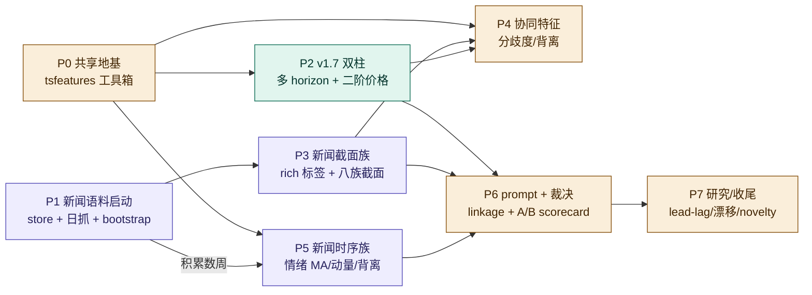

# V1.7 + V1.8 协同开发计划

> v1.7([因子/趋势:多 horizon + 二阶特征](v1.7-progress.md))与 v1.8([新闻指标化](v1.8-progress.md))
> **一起做**。本文件是两版的**统一排期 + 依赖 + 里程碑**,各自的设计细节看对应 progress 文档。
> 时间:2026-06-25 起。**总进度看本文件;细节看分版文档。**

## 排期三条核心判断

1. **抽共享 `tsfeatures` 时序工具箱** —— v1.7 二阶特征 = v1.8 时序动态族,同一套数学(喂的序列不同)。
   **先建工具箱,两版复用**(`rolling_mean / momentum / acceleration / zscore / slope / reversal_flag / streak / dispersion`)。
2. **新闻语料库 + 前向积累要尽早启动** —— 时序情绪特征**时间门控**:语料库越早开始攒,时序族越早有数据。
   所以 v1.8 的存储 + 日抓在最前面就铺好,边攒边开发后续。
3. **v1.7 先见效,v1.8 时序族最后** —— v1.7(多 horizon + 二阶)即改即见(scorecard 立刻变密);
   v1.8 截面族也无需历史;**唯独 v1.8 时序族要等积累**。

## 依赖图

> 🟢 v1.7(因子) · 🟣 v1.8(新闻) · 🟡 共享/协同

## 阶段表

> 状态:☐ 未开始 · ◐ 进行中 · ✅ 完成。

| 阶段 | 归属 | 内容 | 依赖 | 即见效? | 状态 |
|---|---|---|---|---|---|
| **P0 共享地基** | 共享 | `tsfeatures.py` 时序工具箱 + 单测(9) | — | — | ✅ |
| **P1 新闻语料启动** | v1.8 | `news/store.py` 单语料库 parquet(月分区/uuid 幂等/body 列/extra)+ Basic `limit=25`/per_asset 15;**前向日抓接入 pipeline** ✅;bootstrap 最近一月待运维 | — | 攒数据(时间门控) | ◐ |
| **P2 v1.7 双柱** | v1.7 | 多 horizon(schema/prompt + render 三处)+ 二阶价格特征(用 P0)| P0 | ✅ 已落地,实跑期限结构成立 | ✅ |
| **P3 新闻截面族** | v1.8 | rich 逐篇标签(sentiment 连续)+ `textsignals`(EPU/GPR/鹰鸽/事件)+ 截面族(情绪+分歧度/不确定/地缘/事件/category)+ **补已提取未用** | P1 | ✅ 截面无需历史 | ✅ |
| **P4 协同特征** | 共享 | 情绪—价格背离 ✅(合入 D);分歧度(新闻 ✅;跨模型/跨 horizon 校准待做) | P0,P2,P3 | 部分 | ◐ |
| **P5 新闻时序族** | v1.8 | 情绪 5/20/60d 均值/动量/持续度 + 量异常 z + 背离(`compute_news_trends`,读 P1 积累) | P0,P1(积累) | ⏳ 待积累 | ✅ 代码 |
| **P6 prompt + 裁决** | 共享 | linkage_map 事件层 ✅ + prompt §9 接入(仅 B 臂)✅;A/B scorecard 统一裁决 | P2–P5 | 验证 | ◐(接入✅;裁决待积累)|
| **P7 研究/收尾** | 共享 | 离线 lead-lag、新闻后漂移、novelty(embedding)、跨资产外溢 | P5 积累足 | 研究 | ☐ 延后 |

## 里程碑

- **M1 地基就绪 + 开始攒**(P0 + P1):工具箱 + 语料库到位,**前向新闻每天开始积累**(越早越好)。
- **M2 v1.7 上线**(P2):多 horizon + 二阶价格落地,命中率页**期限结构变密**,校准/技能数据积累快 3×。
- **M3 新闻截面进 B 臂**(P3 + 部分 P6):截面八族喂预测(B 臂),A/B 开始记账。
- **M4 首份前向结论**(积累 ~4 周后,P5 + P6):时序族 + 统一裁决,出**第一份"二阶 / 新闻到底有没有用"的前向**
  (非回填、可信)scorecard 结论。

## 贯穿纪律

- **代码算特征 → LLM 只解释**:所有特征(价格二阶 + 新闻八族)代码算,LLM 只解释;预测 LLM 不读新闻全文。
- **只前向可信**:回填(价格修订 + 新闻记忆/重抓)标 `source=backfill`,只 `forward` 进裁决。
- **测不假设 + A/B**:二阶、新闻、领先/滞后一律当 code feature 走 A/B,scorecard 裁决;期望**校准 > 方向 alpha**。
- **测试纪律**:管线类改动**每次只跑 1–2 天**验证(效果未知前别整月跑)。
- **PIT / 防先知**:历史回放走 backfill 时间窗(已落地);新闻语料按 `published_at` 归期。

## 延后 / 待办清单(及原因)—— 截至 2026-06-25 后端落地后

> 后端核心已落地(177 测试绿、实跑验证)。以下是**有意延后**的,按"为什么现在不做"分类:

**A. 时间门控(需前向积累数周才出数,代码已就位)**
- **A/B + scorecard 统一裁决"二阶 / 新闻到底有没有用"**:只信 `forward`;语料库 / 预测账本需积累几周。
- **新闻时序族出真值**:`compute_news_trends` 已写,但语料库 <10 天时 sentMean20 / 背离多为 None(正常,非 bug)。
- **离线 lead-lag / 新闻后漂移**(P7):需足够历史样本才有意义。

**B. 运维(非代码,需在运行环境跑)**
- **Bootstrap 最近一月新闻** + **每日前向调度**:需 `THENEWSAPI_KEYS`(Basic)在 cron / 本机环境;越早开抓越好。
- **多模型**:实跑暂用 deepseek(Claude 中转站近期不稳);中转站恢复或接官方 API 后即多模型。

**C. 依赖 / 成本(效果未知前不上)**
- **novelty(陈旧/回声)**:需 embedding / 文本相似度依赖(`sentence-transformers` 之类),较重。
- **逐篇分析的"相关性/关键词初判过滤"**(B 阶段):现靠源白名单 + 抽取质量门;LLM 量当前不是瓶颈,暂不加。
- **语料库 `existing_uuids` 接管"跳过已分析"**:现状重生成某天会**重跑 LLM 分类**(见下方"新闻存储"问答);
  本期可接受(rapid iteration),要省 LLM 再上。

**D. 前端(按目标显式牺牲,最终阶段统一兼容)**
- 简报假设层期限结构展示;命中率页 asset×horizon 网格变密;新闻指标 UI;非交易日"咖啡/休市"界面。
  后端契约已就位(`session`/`closedReason`/`consensus.horizon`/`trends`/八族),前端后续接。

## 新闻存储机制(append? 重生成会重跑 LLM 吗?)

- **存储 = 月分区 parquet 的 read-modify-write**(不是行级 append):`NewsStore.upsert` 读当月文件 → concat 新行
  → `drop_duplicates(subset=['uuid'], keep='last')` → 写回。**按 uuid 幂等**,重复文章不会增行、新版覆盖旧版。
- **重生成某天**:pipeline 会**重新抓→(ExtractCache 命中则不重抓全文)→重跑 LLM 分类→upsert**。
  即:**全文不会重抓(有缓存),但 LLM 特征提取目前会重跑**,新标签按 uuid keep=last 覆盖。
  → 想"已分析过就跳过 LLM" = 上面 C 的 `existing_uuids` 优化(待做)。

## 与其它版本

- 依赖 v1.6(因子层 / 评估层 / A/B / scorecard)已落地的基础设施。
- 不含 V2 的回填引擎 / 区间聚合 / 多年长历史 / 跨源(GDELT)—— 那些归 V2。
