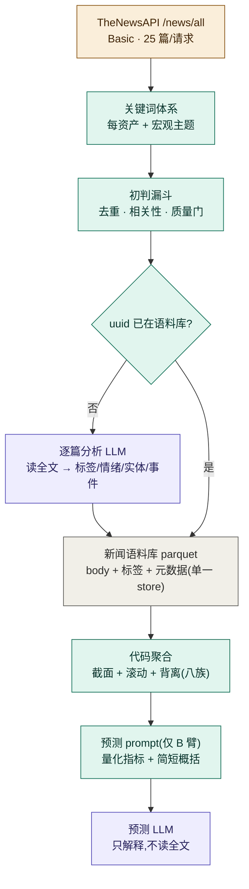

# V1.8 · 新闻指标化(news as a quantified time-series indicator)

> 定位:V1.7(因子/趋势:多 horizon + 二阶特征)之后的**新闻子系统**大改。把新闻从"当天快照"
> 升级成**有历史、可量化、能与价格对照、且 LLM 看得懂**的时序指标。**工作量大于 v1.7**——
> 新闻分析在业内是一整个领域(Bloomberg / RavenPack 把它做成商业产品),特征族多、要积累历史。
> 不改「代码算特征 → LLM 只解释」骨架。
>
> 时间:2026-06-25 起设计。**本文件为设计 + 分步计划(尚未实现,`☐` 待建)**。
> 上游采集运营见 [news-sources.md](../news-sources.md);整体链路见 [architecture.md](../architecture.md)。

## 0. 动机与诚实边界

现状:新闻是 same-day 死水(`compute_news_features` 只算当天 count/净情绪),无历史、无趋势。
目标:让新闻成为**多族、可量化的时序指标**(情绪/关注/不确定性/事件/动态…)。

**诚实边界(先钉死,贯穿全版)**:
1. **反身性 / 内生性(最关键)**:**新闻常是价格的"镜子"而非"先行指标"** —— 记者写"股市因 X 下跌",
   情绪是在**追认已发生的价格**。这是"新闻很少领先流动资产"的根本原因。→ 真价值在**背离**
   (新闻与价格不一致)与**外生事件冲击**,**不是**裸情绪方向。
2. **半强式有效**:对纳指/黄金/美元这类高流动性资产,公开新闻多半**同步或滞后**。
3. **情绪量化本身粗糙**:LLM 的 up/down 标签主观、带模型偏见;通用情感词典会误判金融词
   (故用金融语境,见 Loughran-McDonald)。netSentiment ≠ 真实市场情绪。
4. **量 ≠ 重要性**:SEO/转载灌水;需去重 + 质量加权,且"异常量"比"绝对量"更有信息。
5. **选择/覆盖偏差**:白名单 + 死链丢弃 + paywall 丢弃 → 我们只看到**有偏子集**。
6. **小样本噪声**:几篇文章的日均情绪很抖;趋势需足够量 + 平滑。
7. **回填两类污染**:(a) LLM 记忆该时段、(b) 重抓到**更新版**正文。**只前向 `source=forward` 可信**。
8. **regime 依赖**:同一条头条在紧缩恐慌 vs 宽松环境里影响不同。
9. **领先/滞后用数据测,不假设**(§5 动态族 + 离线研究)。任何派生特征走 **A/B**,scorecard 裁决。

**目标定位**:主要提升**事件感知 / 校准 + 情绪—价格背离上下文**,**不是**方向 alpha。

## 1. 数据流总览



## 2. 两个 LLM 触点(全文传不传给 LLM)

1. **逐篇分析 LLM**(internal,per-article):**读全文**,产 {sentiment, direction, category, entities,
   event_types, keywords, 摘要}。文章**首次入库时跑一次**,结果存语料库,以后不重跑。
2. **预测 LLM**(生成简报):**绝不读全文**,只拿**代码聚合后的量化指标 + 简短概括 + 个别头条**。

→ **预测 LLM 只收量化指标 + 概括,不收完整新闻**;全文只进①(逐篇分析)。

## 3. 存储:单一 parquet 语料库(corpus)

> 个人非商用,分析侧不设版权限制(全文随便用)。**单表设计**的依据:**parquet 是列存**——
> body 与标签同表,查特征时**只投影特征列、不读 body 列**,所以"全文同表"不拖慢聚合。
> **一张语料库 parquet 既是语料、又可当"别重抓/别重分析"的缓存**(抓前查 uuid)。
> (现状:本期仍保留旧 txt `news_cache` 做抓取去重;让语料库 `existing_uuids` 接管"跳过已分析"是后期优化。)

- 路径:`data/news/news-YYYY-MM.parquet`(**按月分区**;追加当月、**uuid 幂等去重**)。
- 查询:**DuckDB / DataFusion 直接在 parquet 上跑 SQL**(贴技术栈,零迁移);多年跨源再上 RDBMS + 全文索引。
- git:个人项目可入库;若公开仓库且嫌体积,gitignore 语料库、只入库聚合产物。

**标准公共字段**(参考 schema.org `NewsArticle` / GDELT 通用集;核心真列 + `extra` JSON 扩展):

```
# 身份 / 时间
uuid(主键)        published_at(UTC)      first_seen_date
# 来源 / 溯源
source  domain  url  author  language  locale   source_tag(forward/backfill)
# 内容
title   description(snippet)  body(全文)   word_count
# 逐篇分析(LLM,存一次)
category(事实/解读/噪音)  direction(up/down/watch)  sentiment_score(-1..1)
affected_assets(json)  entities(json)  keywords(json)  event_types(json)  summary
quality_score  relevance_score  uncertainty_score  hawkish_dovish
# 演进
schema_version    extra(json)   # 实验字段先放这,稳定后"提列"
```

**两条铁律**:
- **存逐篇标签,不存聚合结果** —— 改聚合公式(换加权)不用重跑 LLM。
- **聚合(日/滚动)即时算、不落盘**(避免双写;DuckDB 上算很快)。

## 4. 处理漏斗(先便宜过滤,再喂贵的 LLM)

```
抓(/news/all,25/请求,源白名单 + 关键词)
 → 去重(uuid)+ 相关性/关键词初判 + 抽取质量门(已有 _is_hollow/_MIN_CHARS)→ 滤垃圾
 → uuid 已在语料库?是→跳过 LLM;否→喂①逐篇分析 LLM → 写语料库
```
LLM 最贵放最后,只处理"新 + 优质"。

## 5. 新闻特征体系(八大族,业内/学术 grounded)

像 v1.7 的因子族一样组织。**截面族**当天即可算;**时序/动态族**需语料库历史(v1.8 核心价值);
**关系族**当研究、用数据测。每族标了专业出处供查证。

### 5.1 情绪 Sentiment
- `net_sentiment`(逐篇 sentiment 均值)、**`sentiment_dispersion`**(std,**新闻在打架=不确定性↑**,利校准)、
  `bull_bear_ratio`、强度/质量加权情绪。
- 出处:Tetlock 2007《Giving Content to Investor Sentiment》(媒体悲观→短期跌后反转);
  Loughran-McDonald 2011 金融情感词典(通用词典误判金融词)。

### 5.2 关注 / 量 Attention
- `news_volume`、**`abnormal_volume_z`**(相对历史均值,**关注飙升 → 波动↑**)、关注趋势。
- 出处:Da-Engelberg-Gao 2011《In Search of Attention》。

### 5.3 新颖度 Novelty / Staleness
- `novelty_score`(与近期语料相似度,低=陈旧回声)、`echo_ratio`。**陈旧重复新闻→过度反应后反转**。
- 出处:Tetlock 2011《All the News That's Fit to Reprint》。依赖文本相似度/embedding(较重,后期)。

### 5.4 不确定性 Uncertainty
- **`epu_density`**(政策不确定性词频,EPU 轻量版)、对冲/模糊措辞密度。
- 出处:Baker-Bloom-Davis **Economic Policy Uncertainty 指数**(纯新闻构建的著名宏观指标)。

### 5.5 地缘 Geopolitical
- **`gpr_count`**(地缘风险词计数,GPR 轻量版)、冲突/能源/制裁主题强度。
- 出处:Caldara-Iacoviello **Geopolitical Risk 指数**。

### 5.6 事件 Event
- 事件分类标记(货币/财政/地缘/能源/监管…)+ **事件情绪**;**央行鹰鸽语调** `hawkish_dovish`。
- 出处:事件研究法;Fedspeak hawkish/dovish 评分文献。扩展现有 `_EVENT_PATTERNS`(fomc/cpi/jobs/geo)。

### 5.7 时序动态 Dynamics ← 你要的"变化趋势"
- 情绪 **5/20/60d 均值**(走势)、**情绪动量/斜率**(转好/转坏)、**加速度**、**反转 flag**、连涨连跌**持续度**;
  量趋势;**`news_price_divergence`**(情绪 z − 同窗价格收益 z,**背离当上下文**);**新闻后漂移**(类比 PEAD)。
- 出处:类比 Post-Earnings-Announcement Drift;lead-lag 互相关。**只有积累语料库历史才能算**。

### 5.8 关系 / 质量 Meta
- `source_diversity`(源集中度,低=可靠性低)、跨资产外溢(美元新闻→黄金)、实体级情绪。
- 出处:RavenPack / Bloomberg 新闻分析实践。

## 6. 现状基线(已用 / 已提取未用 / 待新增)

| | 字段 |
|---|---|
| **已做成特征**(`compute_news_features`)| count、netSentiment(仅 direction 均值)、events(fomc/cpi/jobs/geo)、headlines —— **全是当天截面** |
| **已提取却没用**(`classify` 已产出)| `category`(事实/解读/噪音)、`affected_assets`、`note` —— **白白浪费,先补上** |
| **待新增**(§5 八族)| sentiment_score 连续值、分歧度、异常量 z、不确定性/地缘、事件情绪/鹰鸽、**全部时序族**、novelty、实体 |

> 另:`classify._body` 现在只喂**前 1500 字**;`extract._MAX_CHARS=4000`。不限调用量后可调高,让长文用满。

## 7. 关键词体系升级(分两层)

- **每资产关键词(扩充)**:2Y/利率 → `FOMC、rate cut/hike、dot plot、Powell、QT、Treasury auction`;
  黄金 → `real yields、safe haven、central bank gold、ETF flows`。
- **跨资产宏观主题频道(新增)**:美联储、财政部/部长、Trump 政策/关税、地缘/能源、欧央行、金融稳定;
  **日韩纳入**(BoJ→套息→美元/美债;韩国半导体→纳指芯片股)。进事件标记 + 宏观情绪/不确定性通道。

## 8. linkage_map 事件层(prompt)

现有 [linkage_map.md](../../py/newsletter/framework/linkage_map.md) 只有价格/利率传导。新增"**事件/新闻 → 资产机制**":
- 鹰派美联储意外 → 2Y↑、实际利率↑、黄金↓、美元↑、成长股↓
- 地缘升级/能源冲击 → 黄金↑、油↑、避险买美元/美债、风险资产↓

**纪律**:只写**因果机制**,不写未验证的"领先 N 天";prompt 保留"新闻方向力弱,主要用于事件/背离,勿过度自信"。

## 9. 抓取量 / 调度(一天抓多少)

Basic = 25 篇/请求、单 api-key token、一天可以调用上千次.
- 每资产 1 请求 + 宏观主题 ~3–5 请求 → **~7–9 请求/天**(配额零头)。去重初判后**每资产 ~15–20 篇**优质分析量,
  全天 **~60–100 篇**;raw count 本身是信号也记下。**`thenewsapi.py` 把 `min(limit,3)` 放开到 25**。
- **Bootstrap**:一次性回填最近一月(backfill 时间窗,防先知)灌满语料库;**稳定后每天只增量抓当天**。
- **测试纪律**:效果未知前**每次只跑 1–2 天**验证管线。

## 10. 分步计划(按阶段,工作量大于 v1.7)

> 状态:☐ 未开始 · ◐ 进行中 · ✅ 完成。

| 阶段 | 内容 | 状态 |
|---|---|---|
| **A 存储基础** | `news/store.py` 单一语料库 parquet(月分区 + uuid 幂等 + body 列 + extra/schema_version);Basic `limit=25` + per_asset 15 | ✅ |
| **B 漏斗 + 逐篇分析增强** | 逐篇 LLM 加 `sentiment` 连续值;`textsignals.py` 代码算 event_types/EPU/GPR/不确定/鹰鸽;`build_article_records` 入库 | ◐(rich 标签✅;"相关性/关键词初判过滤" 与放开 body 截断 待做)|
| **C 截面特征族** | 情绪(+分歧度)、不确定性(EPU/uncertainty)、地缘(GPR)、事件(分类法)、鹰鸽、category 构成;**已提取未用的 category/affected_assets 已补** | ✅ |
| **D 时序特征族** | `compute_news_trends`:情绪 5/20/60d 均值/动量(斜率)/持续度 + 量异常 z + **情绪—价格背离**(P4 合入) | ✅ |
| **E 关系/研究** | 离线 lead-lag、新闻后漂移、跨资产外溢、novelty(embedding) | ☐ 延后(依赖前向积累 + embedding 依赖;效果未知前不上)|
| **F prompt + 裁决** | linkage_map 事件层 ✅ + prompt §9 接入(仅 B 臂)✅;A/B scorecard 统一裁决 | ◐(接入✅;裁决待前向积累数周)|
| **G 调度** | Bootstrap 最近一月 + 前向日常增量 | ☐ 待运维(需 Basic key 在运行环境 + 时间积累)|

### 实现记录 / 经验(2026-06-25)
- **`no_data` 检测真实奏效**:实跑 06-24 → "应为交易日但无 NASDAQCOM 观测" → no_data brief。原因 **FRED 价格 ~1 天发布滞后**
  (06-25 时 NASDAQCOM 最新只到 06-23)。**回填/区间 end 用 `last_observation_date` 截到最新有数据日**,别用日历今天。
- **1 天语料库会崩 `compute_news_trends`**:`min_periods 2 > window 1`(`slope(sent,1)`)。已修 `tsfeatures._min_periods`
  钳到窗口大小(n=1→1)。**经验:滚动算子 min_periods 必须 ≤ window**,否则首日/稀疏序列直接抛。
- **时序/背离是"时间门控"**:语料库 <10 天时 sentMean20/divergence 多为 None(min_periods 不满)—— 正常,需前向积累,非 bug。
- **多 horizon 期限结构实跑成立**:deepseek 对 NASDAQCOM 给 5d down/20d down/60d flat(真期限结构),12 条不重不漏。
- **新闻源已干净**:实跑 29 条全是 yahoo/businessinsider/economictimes,**零 Benzinga**,入语料库 uuid 幂等。
- **诚实**:本地 `predictions.csv` 当前是半成品(历史重置残留),实跑行数对不齐属旧数据污染,全量重跑会洗净。

## 10.5 与 v1.7 的协同(复用 + 排序)

v1.8 与 [v1.7(因子/趋势)](v1.7-progress.md) **同期开发**,**v1.8 复用 v1.7 先落地的基础设施**(总排期见 [协同开发计划](v1.7-v1.8-plan.md)):

- **`tsfeatures` 时序工具箱**(v1.7 建):v1.8 时序动态族(§5.7)直接用其
  `rolling_mean / momentum / acceleration / zscore / reversal / streak`,只是喂**情绪序列**。
- **evaluate `_factor` lane + scorecard asset×horizon 网格 + A/B B 臂**(v1.6/v1.7):新闻信号当一个"参赛选手"
  在同一套机制里裁决,**不另造评估**。
- **多 horizon ↔ 多窗口对齐**:v1.7 的 {5d,20d,60d} 预测期限与 v1.8 的 {5/20/60d} 情绪窗口天然对齐
  (可做"20d 情绪趋势 → 20d 方向"的期限对齐喂法)。

**排序**:v1.7 先(即改即见效 + 建工具箱);v1.8 的**语料库 + 前向积累尽早启动**(时间门控,越早攒越快有时序特征)。

## 11. 参考(业内/学术,供查证)

- Tetlock 2007《Giving Content to Investor Sentiment》;2011《All the News That's Fit to Reprint》(stale news)
- Loughran & McDonald 2011 金融情感词典
- Baker, Bloom & Davis — Economic Policy Uncertainty(EPU)指数
- Caldara & Iacoviello — Geopolitical Risk(GPR)指数
- Da, Engelberg & Gao 2011《In Search of Attention》
- 央行沟通鹰鸽语调(Fedspeak)文献;事件研究法;PEAD(盈余公告后漂移,类比新闻后漂移)
- 商业实践:Bloomberg / RavenPack 新闻分析

## 12. 不做 / 边界

- **不喂全文给预测 LLM**(只量化 + 概括);逐篇分析 LLM 照常读全文。
- **不预设领先/滞后**(用数据测);**不追方向 alpha**(目标=校准 + 背离);**只前向可信**。
- novelty/embedding、跨源(GDELT)、多年长历史归后期;本版聚焦 TheNewsAPI + 月级积累 + 八族特征落地。
