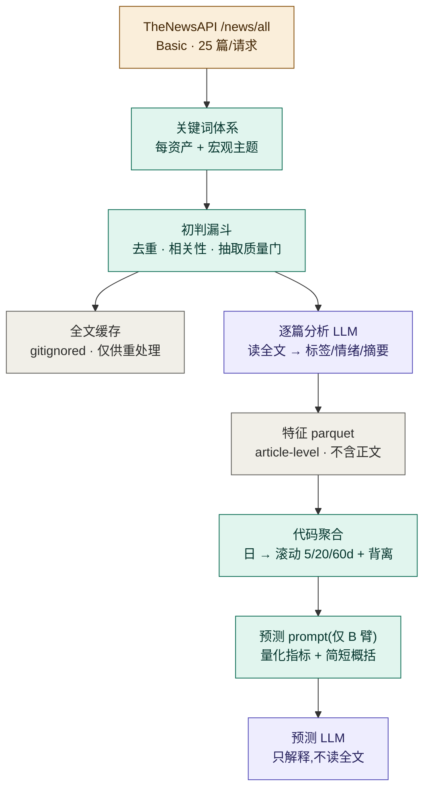

# V1.8 · 新闻指标化(news as a quantified time-series indicator)

> 定位:V1.7(因子/趋势:多 horizon + 二阶特征)之后的一段**新闻子系统**增强。
> 把新闻从"当天快照"升级成**有历史、可量化、能与价格对照、且 LLM 看得懂**的时序指标。
> 不改「代码算特征 → LLM 只解释」骨架。
>
> 时间:2026-06-25 起设计。**本文件为设计 + 分步计划(尚未实现,`☐` 待建)**。
> 上游采集运营手册见 [news-sources.md](../news-sources.md);整体链路见 [architecture.md](../architecture.md)。

## 0. 动机与诚实边界

现状:新闻是 same-day 死水(`compute_news_features` 只算当天 count/净情绪),无历史、无趋势、不可对照。
目标:让新闻成为**可量化的时序指标**(最近 1 周 / 1 月 / 60 天的情绪走势、量能、事件)。

**诚实边界(贯穿全版,先钉死)**:
- 对纳指/黄金/美元这类**高流动性**资产,公开新闻多半**同步或滞后**(半强式有效)→ 新闻的现实价值是
  **事件感知/校准 + 情绪—价格背离上下文**,**不是**方向 alpha。别预设"新闻领先价格"。
- **领先/滞后用数据测,不假设**(§6 的离线 lead-lag)。
- **只有前向(`source=forward`)的新闻指标可信**;回填部分含记忆污染,`source=backfill` 标注、只前向进评估。
- 任何派生特征走 **A/B**(扩展现有 B 臂),由 scorecard 裁决,不靠"应该有用"。

## 1. 数据流总览



## 2. 两个 LLM 触点(回答:全文传不传给 LLM)

**有两处 LLM,别混**:
1. **逐篇分析 LLM**(internal,per-article):**读全文**,产出 {direction, sentiment, category, keywords, 简短摘要}。
   只在文章**首次入库时跑一次**,结果存 parquet,以后不重跑。
2. **预测 LLM**(生成简报的那个):**绝不读全文**,只拿到**代码聚合后的量化指标 + 简短概括 + 个别头条**。

→ **回答你的问题:对,预测 LLM 只收到量化指标 + 简单概括,不收完整新闻。** 全文只进①(逐篇分析),
是"代码算特征 → LLM 只解释"在新闻侧的体现。

## 3. 两层存储(工程分层,非版权)

> 个人非商用项目,**分析侧不设版权限制**:全文照常喂 LLM、尽量挖满信息。
> 分两层纯属**工程考量**(git 仓库别被批量正文撑肥 + 特征库保持精简可查),不是版权。

| 层 | 路径 | 内容 | git |
|---|---|---|---|
| 全文存储 | `data/news_cache/`(已有,可加 parquet) | 抓来的**正文**,供重处理/全文检索;放开用 | 🚫 ignored(**仅因体积**,非版权) |
| **特征 parquet** | `data/news/news-YYYY-MM.parquet` | 派生特征 + 元数据 + 短摘要(精简、可查) | ✅ 入库 |

- 把正文留本地、特征库进 git,是为了**查询效率 + 仓库轻量**;想要"全文也入 parquet"可单建一份**本地(gitignored)**的 body parquet,不进 git。
- **唯一真沾"发布"的**:若 GitHub 是**公开**仓库,commit 正文 = 公开转载;私有仓库无所谓。默认正文不进 git,纯避免膨胀。
- 顺带:`extract.py` 的 `_MAX_CHARS`(现 4000)是喂 LLM 的**单篇上限**,既然不限调用量,可按需调高让长文用得更满。

## 4. 特征 parquet schema(article-level)

一行 = 一篇文章。**核心字段用真列,实验字段进 `extra`(JSON),稳定后"提列"**:

```
# 身份 / 时间
uuid (主键)                 published_at           first_seen_date   # 首次抓到的运行日
# 来源 / 诚实
source        url           source_tag            # forward / backfill
# 初判(代码,便宜)
quality_score relevance     matched_keywords(json) related_assets(json)
# 逐篇分析(LLM,贵,存一次)
category      direction     sentiment(-1..1)      summary(短,我们写的)
affected_assets(json)       event_types(json)
# 演进 / 扩展
schema_version              extra(json)           # 新字段先塞这,稳定后升为真列
```
- **时间键 = `published_at`**(文章自身发布时刻);滚动窗按它算。`first_seen_date` 是元数据。
- **`extra` 的代价**:JSON-in-string **不能当列直接查**(要解析)→ 稳定字段务必**提列**;`schema_version` 便于迁移。
- **存 LLM 的逐篇标签,不存聚合结果** —— 以后改聚合公式(换加权法)**不用重跑 LLM**。

**工程**:按月分区(避免每天重写巨型单文件);**按 uuid 幂等去重**(跨天/重跑不重复);
日/周/月聚合**从这张表算**,不另存一份(避免双写)。

## 5. 处理漏斗(先便宜过滤,再喂贵的 LLM)

```
抓(/news/all,25/请求,源白名单 + 关键词)
  → 去重(uuid)+ 相关性/关键词初判 + 抽取质量门(已有 _is_hollow/_MIN_CHARS)→ 滤掉垃圾
  → 仅幸存者喂①逐篇分析 LLM → 写 parquet
```
LLM 是最贵一环,放最后只处理优质条目。**一旦入库不再重处理**;日常只对当天新文跑 LLM。

## 6. 量化特征(日 + 滚动)

- **日频**(每资产):`count`、`netSentiment`(逐篇 direction/sentiment 均值)、`volume`、事件标记、宏观主题情绪。
- **滚动 5/20/60d**:情绪均值(走势)、**情绪动量**(Δ:本周 vs 上周,= 新闻的二阶)、**新闻量 z-score**(识别刷屏=催化剂)。
- **情绪—价格背离** `news_price_divergence` = 情绪 z − 同窗口价格收益 z(背离当上下文信号,不当方向预测)。
- **领先/滞后(离线研究,不进实时特征)**:算 `corr(情绪(t), 收益(t+k))`,k∈[−5,+5],让数据告诉我们领先还是滞后。

## 7. 关键词体系升级(分两层)

现有 `ROSTER_QUERIES` 太浅。升级:
- **每资产关键词(扩充)**:如 2Y/利率 → `FOMC、rate cut/hike、dot plot、Powell、QT、Treasury auction`;
  黄金 → `real yields、safe haven、central bank gold、ETF flows`。
- **跨资产宏观主题频道(新增,影响全体)**:美联储政策、财政部/部长、Trump 政策/关税、地缘冲突/能源、
  欧央行、金融稳定;**日韩纳入**(BoJ → 套息 → 美元/美债;韩国半导体 → 纳指芯片股)。进事件标记 + 宏观情绪通道。

## 8. linkage_map 事件层(prompt)

现有 [linkage_map.md](../../py/newsletter/framework/linkage_map.md) 只有**价格/利率传导**,无事件层。新增"**事件/新闻 → 资产机制**"一节,例:
- 鹰派美联储意外 → 2Y↑、实际利率↑、黄金↓、美元↑、成长股↓
- 地缘升级/能源冲击 → 黄金↑、油↑、避险买美元/美债、风险资产↓

**纪律**:linkage_map 只写**因果机制**,**不写**未验证的"领先 N 天";prompt 保留"新闻方向力弱,主要用于事件/背离,勿过度自信"。

## 9. 抓取量 / 调度(回答:一天抓多少篇合适)

Basic = **25 篇/请求、单 token**。建议:
- **每资产 1 请求**(按 `published_at` 取最新 25)→ 4 资产;**宏观主题** ~3–5 请求 → 合计 **~7–9 请求/天**(对 Basic 配额是零头)。
- 去重 + 初判后,**目标每资产 ~15–20 篇优质分析量**(够让日情绪均值稳定;对 4 个高流动性资产,更多篇边际信号迅速衰减)。
  **全天 ~60–100 篇**优质入库分析。
- **新闻量(raw count,从 API meta 取)本身是信号**,即便不逐篇深析也记下来。
- **代码里把 `limit=3` 放开到 25**(`thenewsapi.py` 现硬编码 `min(limit,3)`)。

**调度**:
- **Bootstrap**:一次性回填**最近一月**(每天 backfill 时间窗,走防先知路径)→ 灌满语料/parquet。
- **稳定后**:每天只增量抓**当天**新文,append 进当月 parquet。
- **测试纪律**:效果未知前,**每次只跑 1–2 天**验证管线,别整月跑。

## 10. 分步计划

> 状态:☐ 未开始 · ◐ 进行中 · ✅ 完成。

| 步 | 内容 | 状态 |
|---|---|---|
| **S1** | `news/store.py`:article-level parquet(月分区 + uuid 幂等 + extra/schema_version)+ 单测 | ☐ |
| **S2** | 漏斗:初判过滤(相关性/关键词)+ Basic `limit=25` 放开;逐篇分析 LLM 产 rich 标签写库 | ☐ |
| **S3** | 关键词体系升级(每资产 + 宏观主题频道)+ 事件 taxonomy 扩展 | ☐ |
| **S4** | 滚动特征(5/20/60d 情绪/动量/量 z)+ 背离;从 parquet 上算 | ☐ |
| **S5** | linkage_map 事件层 + prompt 接入(仅 B 臂)| ☐ |
| **S6** | 离线 lead-lag 研究(corr at lags);前向积累后用 scorecard 裁决新闻增量 | ☐ |
| **S7** | Bootstrap 最近一月 + 前向日常增量接入调度 | ☐ |

## 11. 不做 / 边界

- **不喂全文给预测 LLM**(只量化指标 + 概括)—— 这是"代码算特征"的分层纪律,非版权;逐篇分析 LLM 照常读全文。
- **正文默认不进 git 仓库**(纯避免膨胀,非版权;本地全文随便存随便用)。
- **不预设领先/滞后**(用 §6 数据测)。
- **不追方向 alpha**(目标=校准 + 背离上下文);只前向数据可信。
- 真·长历史(多年新闻)与跨源(GDELT 等)归更后;本版聚焦 TheNewsAPI + 月级积累。
